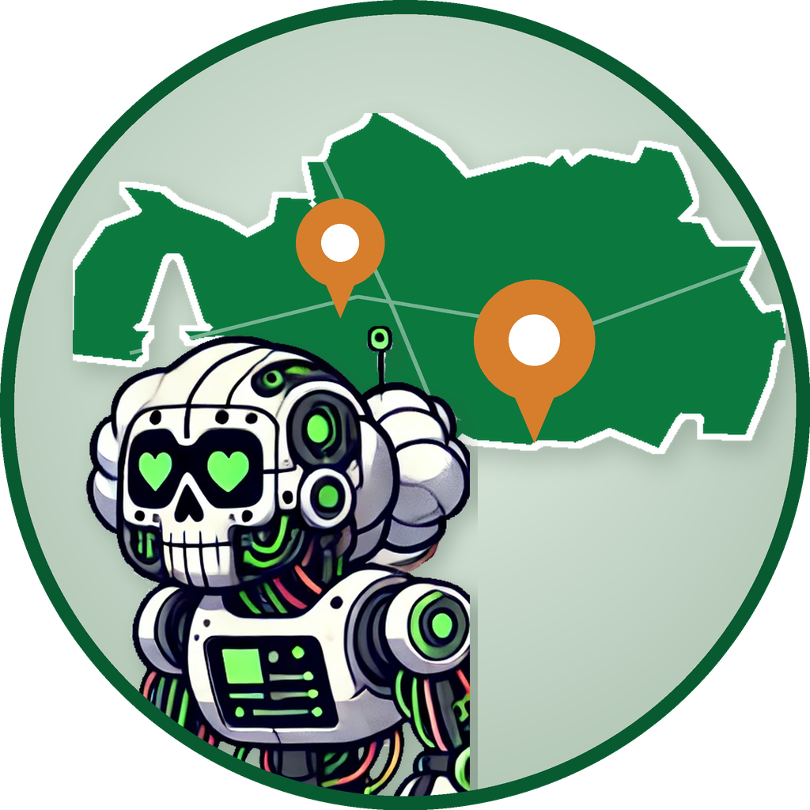

# Bot Paisaje Lingüístico Andaluz

<p align="center">
  
</p>

Bot de Telegram que detecta fotos compartidas en el grupo y guía a la persona
por privado para completar y subir su aportación a andaluh.ushahidi.io.

## Configuración en BotFather

1. Habla con @BotFather → `/newbot` → guarda el token.
2. **Importante**: `/setprivacy` → tu bot → `Disable`. Sin esto el bot no ve
   las fotos del grupo (solo vería comandos).
3. Añade el bot al grupo t.me/paisajeand.

## Variables de entorno

```bash
export TELEGRAM_TOKEN="123456:ABC..."
export USHAHIDI_EMAIL="cuenta-telegram@ejemplo.com"  # cuenta POR DEFECTO del bot
export USHAHIDI_PASSWORD="********"
```

Opcional: en grupos con topics (foros), `TELEGRAM_TOPIC_IDS` limita en qué
topics atiende el bot. Acepta ids sueltos (`123`, vale para cualquier foro) y
pares `chat:topic` (`-100123456789:123`, solo ese grupo), separados por comas.
Los grupos **sin** topics no se ven afectados: ahí el bot atiende siempre.
Los ids aparecen en el log del bot (`chat=...`, `thread=...`) al escribir en
el topic. Sin definir la variable, el bot atiende en todos los sitios.

`USHAHIDI_EMAIL`/`USHAHIDI_PASSWORD` son la **cuenta por defecto** del bot en
andaluh.ushahidi.io: una cuenta normal creada solo para esto (p. ej. "Telegram
Paisaje Andaluz"). Todas las aportaciones de quien no use cuenta propia se
suben con ella, lo que permite identificar en Ushahidi qué llegó desde Telegram.

## Cuentas de Ushahidi

Al empezar una aportación, el bot pregunta con qué cuenta subirla:

1. **Sin cuenta propia** (opción por defecto): usa la cuenta colectiva del bot.
2. **Mi cuenta**: pide email y contraseña de andaluh.ushahidi.io, comprueba que
   funcionan y sube la aportación a nombre de esa persona. El mensaje con la
   contraseña se borra del chat, y las credenciales se guardan solo en memoria
   (al reiniciar el bot se vuelve a preguntar).
3. **Crear cuenta nueva**: registra la cuenta vía `POST /api/v3/register`.
   ⚠️ Solo funciona si el registro está habilitado en los ajustes del
   despliegue; a día de hoy `disable_registration` está **activado** en
   andaluh.ushahidi.io, así que esta opción fallará (el bot lo explica y
   ofrece las otras) hasta que se active desde el panel de Ushahidi.

La elección se recuerda entre aportaciones; el comando `/cuenta` la olvida
para poder elegir de nuevo.

## Instalación y ejecución (con virtualenv)

Usar un entorno virtual evita mezclar las dependencias del bot con las del
sistema. Solo hay que crearlo la primera vez:

```bash
# 1. Crear el entorno virtual (solo la primera vez)
python3 -m venv .venv

# 2. Activarlo (en cada terminal nueva)
source .venv/bin/activate

# 3. Instalar las dependencias (solo la primera vez o si cambia requirements.txt)
pip install -r requirements.txt
```

Para arrancar el bot (con el entorno activado):

```bash
# Cargar las variables del .env en la terminal y ejecutar
set -a; source .env; set +a
python bot.py
```

Para pararlo, `Ctrl+C`. Para salir del entorno virtual, `deactivate`.

> 💡 Si al abrir una terminal nueva `python bot.py` falla con
> `ModuleNotFoundError`, casi seguro que falta el paso 2 (`source .venv/bin/activate`).

## Ejecución con Docker (recomendado para dejarlo 24/7)

Con Docker no hace falta virtualenv ni cargar el `.env` a mano: `docker compose`
lee el `.env` automáticamente (`env_file`) y reinicia el bot solo si se cae o
si se reinicia la máquina (`restart: unless-stopped`).

```bash
# Arrancar (construye la imagen la primera vez)
docker compose up -d

# Ver los logs en directo (salir con Ctrl+C, el bot sigue corriendo)
docker compose logs -f

# Parar
docker compose down

# Tras cambiar el código, reconstruir y relanzar
docker compose up -d --build
```

⚠️ Solo puede haber **una** instancia del bot a la vez (Telegram rechaza dos
conexiones con el mismo token): si lo arrancas con Docker, no lo tengas
corriendo también en la terminal.

## Estructura

- `bot.py` — handlers de Telegram y máquina de estados de la conversación
- `ushahidi.py` — cliente de la API (OAuth2, subida de media, creación de posts)
- `config.py` — ids y claves de los campos de la encuesta "Corpus"

## Notas para la primera prueba

- Los posts entran como *pendientes de revisión* (`require_approval: true` en
  la encuesta), así que hay que aprobarlos desde la web de Ushahidi.
- Si `create_post` devuelve un 422, el cuerpo de la respuesta indica campo a
  campo qué no le ha gustado: los formatos del valor de `media` y de los
  `checkbox` son los dos candidatos a necesitar un pequeño ajuste.
- El estado se guarda en memoria: si el bot se reinicia a mitad de una
  conversación, esa aportación se pierde. Se puede añadir persistencia con
  `PicklePersistence` de python-telegram-bot más adelante.
